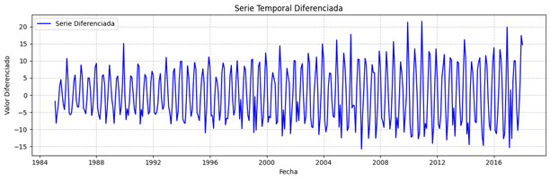
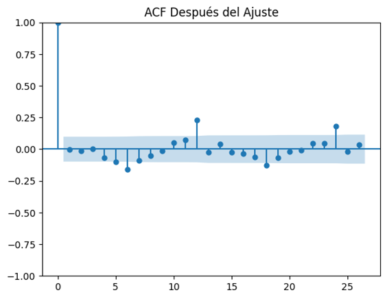
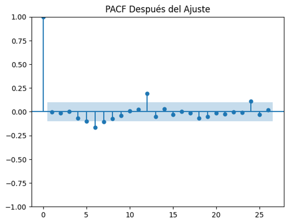
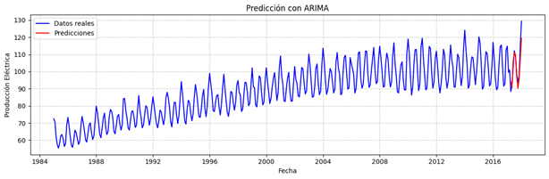
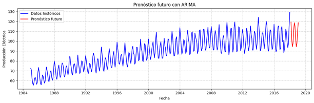
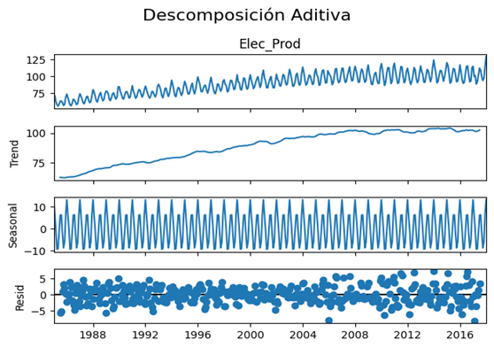

<h1>ARIMA Model Report for Electricity Production</h1>
    
<h2>1. Introduction</h2>
  
 
        This report documents the analysis and prediction of electricity production using the 
        Autoregressive Integrated Moving Average (ARIMA) model. This model was applied to a 
        time series of monthly data, obtained from a Google Drive source, which records electricity 
        production over an extended period. The main objective was to identify underlying patterns, 
        such as trend and seasonality, and to generate accurate forecasts for future decisions.
    

    

        The database used contains a column of dates and values associated with electricity 
        production, previously processed to facilitate its interpretation. These data served as input 
        to build the model and validate its performance in short and medium-term predictions.
    

<h2>2. Description of the Data Set</h2>
    

        The analyzed time series represents monthly electricity production and is characterized by 
        the following properties:
    

    <ul>
        <li><strong>Data source:</strong> Historical data downloaded from a shared link.</li>
        <li><strong>Frequency:</strong> Monthly.</li>
        <li><strong>Target variable:</strong> <code>Elec_Prod</code>, which quantifies electricity production.</li>
        <li><strong>Structure:</strong> One column for dates (<code>'DATE'</code>) and another for numeric values, initially 
        named <code>'IPG2211A2N'</code> and renamed for clarity.</li>
    </ul>
    

        Upon initial inspection, a general growth trend accompanied by recurrent seasonal 
        fluctuations was observed, indicating the need for a model capable of capturing both these 
        features and residual noise.
    

<h2>3. Methodology</h2>
    
<h3>Data Preparation</h3>
    

        Data preprocessing included the conversion of the <code>'DATE'</code> column to datetime format and 
        its configuration as an index to facilitate temporal analysis. In addition, a preliminary 
        visualization was performed to identify obvious patterns of trend and seasonality.
    

    
    
<h3>Verification of Stationarity </h3>
    

        The stationarity of the series was evaluated using the Augmented Dickey-Fuller (ADF) test. 
        Initially, the test indicated that the series was not stationary. To address this, simple 
        differencing was applied which stabilized the series mean. The subsequent ADF test 
        confirmed that the differenced series was stationary, with a p-index less than 0.05.
    

    

<h3>Identification of ARIMA Parameters </h3>
    

        With the stationary series, the autocorrelation functions (ACF) and partial autocorrelation 
        functions (PACF) were analyzed to identify initial values for the p and q parameters. In 
        addition, the auto_arima tool was used, which suggested a model with p=2, d=1 and q=4 as 
        the optimal configuration. 
    

    
  <h3>Model Adjustment </h3>
      

          The ARIMA (2, 1, 4) model was fitted to the differenced data. During the diagnosis of the 
          residuals: 
        <li>The ACF and PACF functions of the residuals did not show significant autocorrelations.</li>
        <li>The residuals were approximately normally distributed, indicating a good fit of the model.</li>
      

      
      

  <h2>4. Results </h2>
  
  <h3>Model Evaluation </h3>
      

          To evaluate the performance of the model, predictions were made on the last 10 values of 
          the series and compared with the actual data. The mean square error (MSE) obtained was 
          reasonably low, confirming the model's ability to make accurate short-term forecasts.
      

      

  <h3>Future Forecast </h3>
      

          Predictions were generated for the next 12 months. The results showed steady growth 
          accompanied by repetitive seasonality, consistent with the patterns observed in the historical 
          series. The predictions were visualized along with the historical data, evidencing a natural 
          extension of seasonal trends and cycles.
      

      

  <h3>Series Decomposition </h3>
      

          The series decomposition revealed three key components. The trend component showed a sustained 
          growth in electricity production over time, highlighting a long-term upward trajectory. The 
          seasonal component unveiled a consistent annual cycle with recurring peaks and valleys, reflecting 
          predictable fluctuations in electricity demand. Finally, the residuals were randomly distributed 
          around zero, confirming that the main patterns were effectively captured by the trend and seasonality 
          components.
      

      

  <h2>5. Conclusions </h2>
      

          The ARIMA (2, 1, 4) model proved to be an effective tool for capturing the trend and 
          seasonality patterns present in the time series. The predictions made, both in the short 
          and medium term, were consistent with the historical data, and the residuals indicated a 
          good fit of the model. 
          The annual seasonality identified underlines the importance of considering recurring cycles 
          in the analysis of electricity production. In addition, the model presented an adequate 
          performance in the predictions of the last values of the series, validating its usefulness for 
          future applications.
      

